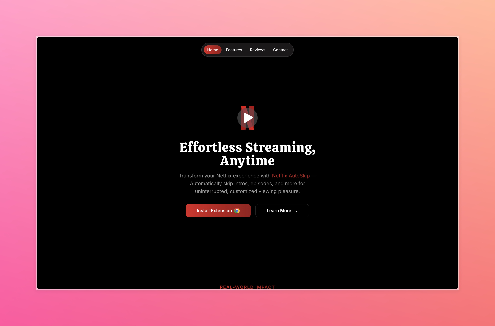

# 🎬 Netflix AutoSkip Website


## Overview

Welcome to the official website for **Netflix AutoSkip**! 🚀 This website showcases the features and benefits of the Netflix AutoSkip Chrome extension, designed to enhance your streaming experience by automating tedious tasks like skipping intros and recaps.

The site is built using **Next.js**, **Framer Motion**, **TailwindCSS**, and **TypeScript** for a fast, responsive, and visually stunning user experience.

## ✨ Features

- **⚡ Powered by Next.js**: Lightning-fast page loads and seamless navigation.
- **🎨 Beautifully Styled with TailwindCSS**: Modern, responsive design that's easy on the eyes.
- **🎥 Engaging Animations with Framer**: Smooth transitions and interactive UI elements.
- **🔐 Strong Typing with TypeScript**: Robust and maintainable code.

## 🚀 Getting Started

Follow these steps to run the Netflix AutoSkip website locally:

### Prerequisites

- [Node.js](https://nodejs.org/) (v14 or higher) 🟢
- [npm](https://www.npmjs.com/) or [yarn](https://yarnpkg.com/) 📦

### Installation

1. **Clone the repository:**

   ```bash
   git clone https://github.com/your-username/netflix-autoskip-website.git
   cd netflix-autoskip-website
   ```

2. **Install dependencies:**

   Using npm:

   ```bash
   npm install
   ```

   Or using yarn:

   ```bash
   yarn install
   ```

3. **Run the development server:**

   ```bash
   npm run dev
   ```

   Or using yarn:

   ```bash
   yarn dev
   ```

4. **Open your browser:**

   Visit [http://localhost:3000](http://localhost:3000) to view the site. 🌐



## 🌍 Deployment

The site is ready for deployment on [Vercel](https://vercel.com/). To deploy:

1. **Sign up for Vercel** and install the Vercel CLI.
2. **Deploy your project:**

   ```bash
   vercel
   ```

   Follow the prompts to complete the deployment process. Your site will be live in minutes! 🚀

## 🤝 Contributing

We welcome contributions! 🎉 If you’d like to help improve the website or add new features, follow these steps:

1. Fork the repository.
2. Create a new branch (`feature/your-feature`).
3. Commit your changes with a descriptive message. 📋
4. Push to your branch and submit a pull request. 🚀

## 📜 License

This project is licensed under the MIT License. See the [LICENSE](./LICENSE) file for more details.

## 📬 Contact

Have questions or need support? Reach out:

- **Email**: roshanshetty2000@gmail.com
- **GitHub**: [RoshanPShetty](https://github.com/RoshanPShetty)

Thank you for checking out Netflix AutoSkip! 🎉 Enjoy a smoother Netflix experience! 🍿
